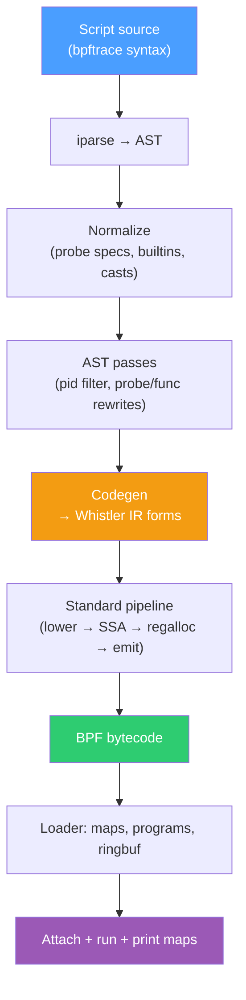

# Overview

`whistler bpftrace` runs scripts written in [bpftrace](https://github.com/bpftrace/bpftrace)'s
surface language. The Whistler binary contains a complete bpftrace
frontend — parser, AST passes, code generator — and reuses the same
SSA/regalloc/peephole pipeline the rest of Whistler does. There's no
separate bpftrace install, no clang, no LLVM, no libbpf.

```sh
sudo whistler bpftrace \
  -e 'tracepoint:syscalls:sys_enter_openat
        { @[comm] = count(); }'
```

## When to reach for it

| Use case | Tool |
|---|---|
| Quick ad-hoc trace from the command line | `whistler bpftrace` |
| Reusing existing bpftrace scripts | `whistler bpftrace` |
| Writing a substantial tracing program | Whistler directly (see [Inline BPF Sessions](../loader/sessions.md)) |
| Anything not eBPF | not Whistler |

The bpftrace frontend exists so the common-case scripts — opensnoop,
biolatency, runqlat, tcpconnect — work out of the box on the same
binary you use for everything else.

## Architecture



Everything from `Codegen` down is shared with the rest of Whistler.
The frontend's job is to translate bpftrace's higher-level surface
into the same s-expression IR the Lisp surface lowers through.

## What's supported

Most of bpftrace's day-to-day surface. See
[Surface Language](./surface.md) for the full inventory; in summary:

- All standard probes — `kprobe`, `kretprobe`, `kfunc`, `kretfunc`,
  `uprobe`, `uretprobe`, `tracepoint`, `profile`, `interval`,
  `BEGIN`, `END` — plus wildcards (`kprobe:tcp_*`) and multi-target
  specs (`kprobe:foo,kprobe:bar`).
- Aggregations: `count`, `sum`, `avg`, `min`, `max`, `stats`, `hist`,
  `lhist`.
- Async actions: `printf` (with `%-16s`/`%05d` format flags),
  `print`, `clear`, `zero`, `delete`, `time`, `exit`.
- String + address builtins: `str` / `kstr`, `ksym`, `usym`, `ntop`,
  `reg("ip")`.
- Built-in variables: `pid`, `tid`, `uid`, `gid`, `comm`, `nsecs`,
  `cpu`, `retval`, `curtask`, `args`, `probe`, `func`, `kstack`,
  `ustack`, `$local`, `@global`, composite `@[k1, k2]`.
- Symbolic constants like `AF_INET`, `O_RDONLY`, `IPPROTO_TCP` —
  resolved from kernel BTF enums plus a curated `#define` table.
  No C headers, no `#include`.
- Struct access: `curtask->pid`, `((struct sock_common *)arg0)->skc_family`
  (BTF-resolved field offsets, scalar fields).
- Control flow: `if`/`else`, ternary, `/predicate/`, `while` loops,
  user-defined `fn`.

## Quick example

The classic opensnoop:

```sh
sudo whistler bpftrace -e \
  'tracepoint:syscalls:sys_enter_openat
     { printf("%-16s %s\n", comm, str(args->filename)); }'
```

Output is a live stream of every `openat()` on the system:

```
Hyprland         /proc/self/stat
ptyxis           /home/green/.local/share/recently-used.xbel
code             /tmp/vscode-typescript.../...
...
```

Ctrl-C dumps any final map state, then exits. See
[Examples](./examples.md) for more.
