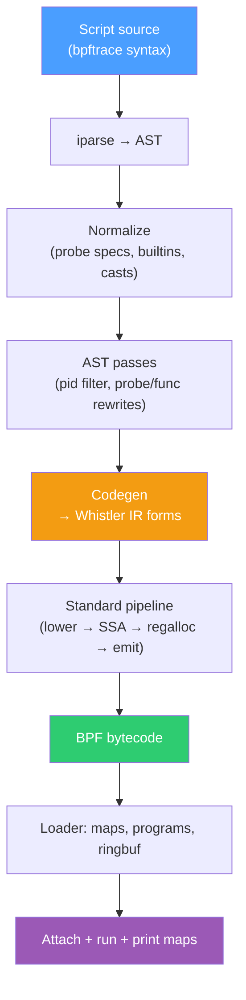

# Overview

`whistler bpftrace` runs scripts written in bpftrace's surface language. The
parser, AST passes, and code generator all live in the same SBCL image and
feed the same SSA pipeline the Lisp surface uses. You don't install bpftrace
separately, and there's no LLVM in the loop.

```sh
sudo whistler bpftrace \
  -e 'tracepoint:syscalls:sys_enter_openat
        { @[comm] = count(); }'
```

The point of the frontend is to make existing scripts — opensnoop,
biolatency, runqlat, tcpconnect — work on the same binary you use for
everything else. If you're writing a substantial tracing program from
scratch, you'll usually be better served by writing Whistler directly; see
[Inline BPF Sessions](../loader/sessions.md).

## Architecture



Everything from codegen down is shared with the rest of Whistler. The
frontend's only job is to turn bpftrace's surface into the same
s-expression IR the Lisp surface lowers through.

## Coverage

The full surface reference is in [Surface Language](./surface.md). At a
glance, the supported set includes every standard probe type (`kprobe`,
`kretprobe`, `kfunc`, `kretfunc`, `uprobe`, `uretprobe`, `tracepoint`,
`profile`, `interval`, `BEGIN`, `END`) with wildcards and multi-target
specs; the usual aggregations (`count`, `sum`, `avg`, `min`, `max`,
`stats`, `hist`, `lhist`); the async-action repertoire (`printf` with
flag/width parsing, `print`, `clear`, `zero`, `delete`, `time`, `exit`);
the string and address builtins (`str`, `kstr`, `ksym`, `usym`, `ntop`,
`reg`); all the built-in variables (`pid`/`tid`/`uid`/`comm`/`nsecs` and
friends, plus `curtask`, `probe`, `func`, `kstack`, `ustack`); symbolic
constants resolved from BTF; struct casts (`((struct sock *)arg0)->field`)
with BTF-driven field offsets; and the control-flow primitives —
`if`/`else`, ternary, filter predicates, `while`, and user-defined `fn`.

Symbolic constants come from kernel BTF enums plus a small curated table
for the `#define`s BTF doesn't carry (`AF_INET`, `O_RDONLY`, mode bits).
No C headers, no `#include`.

## Quick example

The classic opensnoop:

```sh
sudo whistler bpftrace -e \
  'tracepoint:syscalls:sys_enter_openat
     { printf("%-16s %s\n", comm, str(args->filename)); }'
```

Output is one line per `openat` syscall, system-wide:

```
Hyprland         /proc/self/stat
ptyxis           /home/green/.local/share/recently-used.xbel
code             /tmp/vscode-typescript.../...
...
```

Ctrl-C flushes any maps and exits. See [Examples](./examples.md) for more.
