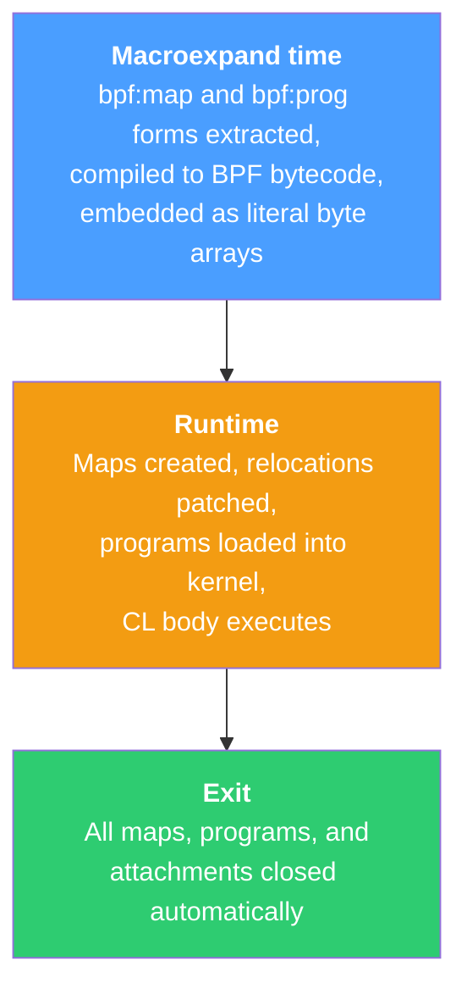

# Inline BPF Sessions

`with-bpf-session` compiles BPF code at macroexpand time and loads it at
runtime, all in one Lisp file. No separate compilation step.

## How it works



## Syntax

```lisp
(with-bpf-session ()
  ;; BPF-side declarations (compiled at macroexpand time):
  (bpf:map NAME :type TYPE :key-size N :value-size N :max-entries N)
  (bpf:prog NAME (OPTIONS...) BODY...)

  ;; Userspace code (runs at runtime):
  (bpf:attach PROG-NAME TARGET ...)
  (bpf:map-ref MAP-NAME KEY)
  ;; ... any CL code ...
  )
```

### bpf:map

Declares a BPF map. Same keyword arguments as `defmap`.

### bpf:prog

Declares a BPF program. The options plist takes `:type`, `:section`, and
`:license`. The body is Whistler BPF code.

### bpf:attach

Attaches a loaded program. The attachment type is auto-detected from the
program's section name:

- `kprobe/...` -- `(bpf:attach prog "function_name")`
- `uprobe/...` -- `(bpf:attach prog "/path/to/binary" "symbol")`
- `tracepoint/...` -- `(bpf:attach prog "tracepoint/cat/event")`
- `cgroup_skb/...` -- `(bpf:attach prog "/sys/fs/cgroup")`

### bpf:map-ref

Reads a map value by integer key, returning the decoded integer value
or `nil`:

```lisp
(bpf:map-ref my-map 0)  ;; -> integer or nil
```

## Package setup

The easiest setup is to work in `whistler-loader-user`, which already imports
the compiler and loader entry points with the right shadowing in place:

```lisp
(asdf:load-system "whistler/loader")
(in-package #:whistler-loader-user)
```

If you want your own application package, use `whistler-loader-user` as the
reference layout instead of rebuilding the package story from scratch.

## Kprobe example

```lisp
(asdf:load-system "whistler/loader")
(in-package #:whistler-loader-user)

(whistler:defstruct call-event
  (pid u32)
  (ts  u64))

(with-bpf-session ()
  (bpf:map events :type :ringbuf :max-entries 4096)

  (bpf:prog trace-exec (:type :kprobe
                         :section "kprobe/__x64_sys_execve"
                         :license "GPL")
    (with-ringbuf (ev events (sizeof call-event))
      (setf (call-event-pid ev) (cast u32 (ash (get-current-pid-tgid) -32))
            (call-event-ts ev)  (ktime-get-ns)))
    0)

  (bpf:attach trace-exec "__x64_sys_execve")

  (let ((consumer (open-decoding-ring-consumer
                   (bpf-session-map 'events)
                   #'decode-call-event
                   (lambda (ev)
                     (format t "exec pid=~d ts=~d~%"
                             (call-event-record-pid ev)
                             (call-event-record-ts ev))))))
    (unwind-protect
         (loop (ring-poll consumer :timeout-ms 1000))
      (close-ring-consumer consumer))))
```

## Cgroup example

```lisp
(with-bpf-session ()
  (bpf:map pkt-count :type :array :key-size 4 :value-size 8 :max-entries 1)

  (bpf:prog count-egress
      (:type :cgroup-skb :section "cgroup_skb/egress" :license "GPL")
    (incf (getmap pkt-count 0))
    1)

  (bpf:attach count-egress "/sys/fs/cgroup")

  (loop repeat 10
        do (sleep 1)
           (format t "packets: ~d~%" (or (bpf:map-ref pkt-count 0) 0))))
```

The attach type (`+bpf-cgroup-inet-egress+`) is inferred automatically
from the section name `"cgroup_skb/egress"`.
